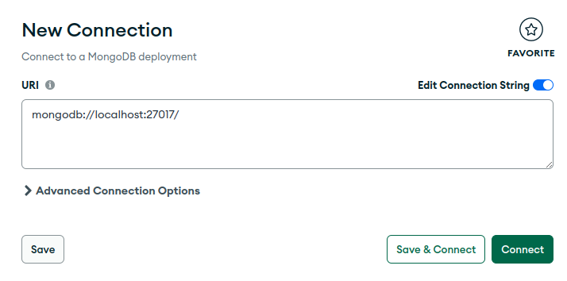

# Ambiente Mongo com Docker

Este repositório possui um arquivo Dockerfile com o script que automatiza a execução de um ambiente containerizado com mongodb.

Qualquer dúvida acerca do uso de containers ou sobre o Docker em geral, veja esse meu outro [repositório](https://github.com/Guilherme-07062002/EstudosDocker.git)

## Primeira execução

Todo o gerenciamento básico deste ambiente é feito por meio do script `mongo`.

Recomenda-se que ao baixar este repositório pela primeira vez acesse o diretório `/container` e execute o comando:

```bash
./mongo
```

Ele é responsável por criar a imagem de nome **mongodb** baseando-se no mongo versão 4.0, disponível no [Docker Hub](https://hub.docker.com/_/mongo).

Em seguida, para inicializar a execução do container com base na imagem criada anteriormente, execute no terminal:

```bash
./mongo start
```

Por fim para finalizar a execução do container execute:

```bash
./mongo stop
```

## Gerenciamento do Mongo por meio do Compass

Recomendo fortemente que baixe o ambiente **MongoDB Compass** disponível [aqui](https://www.mongodb.com/try/download/compass) para download.

Este container está configurado para ser executado na porta **27017** do seu host.

Na interface do MongoDB Compass é esperado que seja exibida essa janela:



O container já esta configurado para ser executado com a porta exibida no exemplo acima, sendo assim só será necessário no primeiro acesso apertar o botão **connect**, se tudo estiver nos conformes a interface do Compass irá exibir a janela de gerenciamento do seu banco mongodb sem maiores problemas.

E agora você poderá trabalhar com o ambiente mongodb, sem que seja preciso ter ele instalado em sua máquina, apenas por meio de um container em Docker e a interface do MongoDB Compass.
